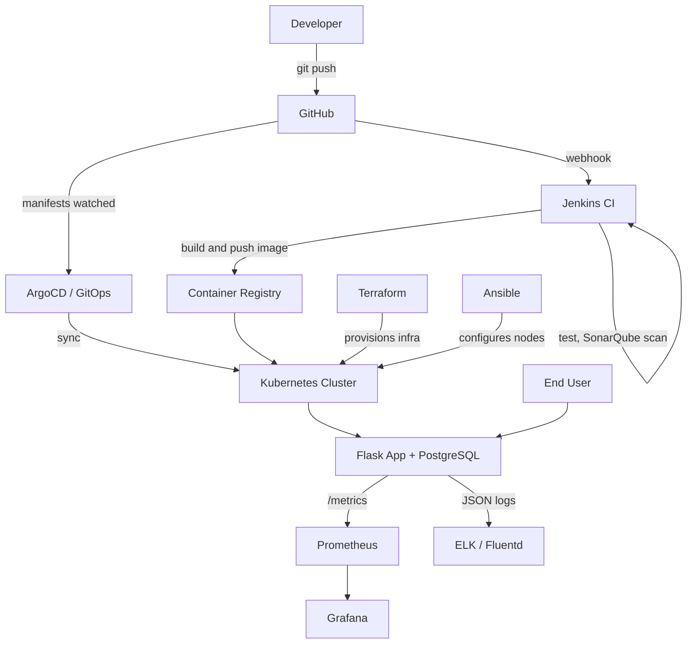

# Task Manager: End-to-End DevOps Pipeline

A cloud-native **Task Manager** web application, built as the capstone project for
**DevOps & Automation Lab (ENSP461)**. The app is intentionally simple. The focus of the
project is the automated pipeline around it: Git, Jenkins, Docker, Kubernetes, Ansible,
Terraform, Prometheus/Grafana, ELK/Fluentd, SonarQube and GitOps.

> **Authors:** _Your Name (Roll No.)_, _Partner Name (Roll No.)_
> **Course:** B.Tech CSE, Semester VII, ENSP461
> **Version:** 1.0.0

---

## Table of Contents
1. [Features](#features)
2. [Architecture](#architecture)
3. [Tech Stack](#tech-stack)
4. [Project Structure](#project-structure)
5. [Getting Started](#getting-started)
6. [Configuration](#configuration)
7. [API Reference](#api-reference)
8. [Testing](#testing)
9. [Docker](#docker)
10. [DevOps Pipeline Status](#devops-pipeline-status)
11. [Git Workflow](#git-workflow)
12. [Screenshots](#screenshots)
13. [Future Scope](#future-scope)

---

## Features

- User registration and login (hashed passwords, session-based auth)
- Task CRUD with title, description, status (`todo`, `in_progress`, `done`) and due date
- Per-user data isolation: users can only see and change their own tasks
- REST API plus a responsive Bootstrap web interface
- Input validation and consistent JSON error responses (400, 401, 404, 405, 500)
- `/health` endpoint (checks database connectivity) for Docker and Kubernetes probes
- `/metrics` endpoint (Prometheus format) for monitoring
- Structured JSON logging for centralized log collection
- Version badge in the UI (`APP_VERSION`) so deployments are visibly different during
  rolling-update and blue-green or canary demos

## Architecture



> Replace this with your final diagram in `docs/architecture.png` for the report.

## Tech Stack

| Layer | Tools |
|---|---|
| Application | Python 3.12, Flask, Flask-SQLAlchemy, Gunicorn |
| Database | SQLite (local dev), PostgreSQL (containers and Kubernetes) |
| Version control | Git, GitHub |
| CI | Jenkins, pytest, pytest-cov, SonarQube |
| Containers | Docker, Docker Compose |
| Orchestration | Kubernetes (minikube/kind) |
| Automation | Ansible, Terraform |
| Observability | Prometheus, Grafana, ELK Stack or Fluentd |
| Delivery | ArgoCD or FluxCD, Blue-Green or Canary |

## Project Structure

```
taskmanager/
├── app/
│   ├── __init__.py        # app factory, JSON logging, metrics, error handlers
│   ├── models.py          # User and Task models
│   ├── routes.py          # REST API + web UI routes + /health
│   └── templates/         # Bootstrap HTML templates
├── tests/
│   └── test_app.py        # pytest suite
├── Dockerfile
├── .dockerignore
├── requirements.txt
├── wsgi.py                # Gunicorn entry point
└── README.md
```

Planned directories (added as each phase is completed):

```
├── docker-compose.yml
├── Jenkinsfile
├── k8s/            # Deployment, Service, ConfigMap, Secret, PV/PVC
├── ansible/        # Docker, Kubernetes, deploy and config playbooks
├── terraform/      # main.tf, variables.tf, outputs.tf, modules/
├── monitoring/     # Prometheus and Grafana configuration
├── logging/        # ELK or Fluentd configuration
├── gitops/         # ArgoCD application manifests
└── docs/           # report, diagrams, screenshots
```

## Getting Started

### Prerequisites
- Python 3.10+ (3.12 recommended)
- Git
- Docker (optional, for the container workflow)

### Run locally

```bash
git clone https://github.com/<your-username>/taskmanager.git
cd taskmanager

python -m venv venv
source venv/bin/activate          # Windows: venv\Scripts\activate
pip install -r requirements.txt

python -m flask --app wsgi run    # http://localhost:5000
```

Open http://localhost:5000, register an account, and start adding tasks.
By default the app uses a local SQLite file (`instance/tasks.db`).

## Configuration

All configuration is through environment variables, so the same image runs unchanged
in Docker, Kubernetes and CI.

| Variable | Default | Description |
|---|---|---|
| `DATABASE_URL` | `sqlite:///tasks.db` | SQLAlchemy URL, e.g. `postgresql://user:pass@db:5432/tasks` |
| `SECRET_KEY` | `dev-secret-change-me` | Session signing key. **Always override outside local dev.** |
| `APP_VERSION` | `1.0.0` | Shown in the UI and `/health`, used to tell releases apart |

In Kubernetes, `DATABASE_URL` and `SECRET_KEY` belong in a **Secret** and `APP_VERSION`
in a **ConfigMap**.

## API Reference

Authentication is session-cookie based. Log in first, then reuse the cookie
(`curl -c cookies.txt` to save it, `-b cookies.txt` to send it).

| Method | Endpoint | Auth | Description |
|---|---|---|---|
| GET | `/health` | no | Liveness and DB check, returns `{"status":"ok","version":"..."}` |
| GET | `/metrics` | no | Prometheus metrics |
| POST | `/api/auth/register` | no | Body: `{"username","password"}` (password min 6 chars) |
| POST | `/api/auth/login` | no | Body: `{"username","password"}` |
| POST | `/api/auth/logout` | no | Clears the session |
| GET | `/api/tasks` | yes | List your tasks (optional `?status=done`) |
| POST | `/api/tasks` | yes | Create a task |
| GET | `/api/tasks/<id>` | yes | Get one task |
| PUT | `/api/tasks/<id>` | yes | Update any of the task fields |
| DELETE | `/api/tasks/<id>` | yes | Delete a task (204) |

**Example**

```bash
curl -c c.txt -X POST localhost:5000/api/auth/register \
  -H "Content-Type: application/json" -d '{"username":"alice","password":"secret123"}'
curl -c c.txt -X POST localhost:5000/api/auth/login \
  -H "Content-Type: application/json" -d '{"username":"alice","password":"secret123"}'
curl -b c.txt -X POST localhost:5000/api/tasks \
  -H "Content-Type: application/json" \
  -d '{"title":"Finish capstone","due_date":"2026-11-15","status":"in_progress"}'
curl -b c.txt localhost:5000/api/tasks
```

**Error format:** `{"error": "<message>"}` with the matching HTTP status code.

## Testing

```bash
pytest --cov=app            # run tests with coverage
pytest --cov=app --cov-report=xml   # XML report for Jenkins / SonarQube
```

The suite covers health checks, registration and login validation, authentication
enforcement, full task CRUD, input validation, per-user data isolation, JSON 404s
and the web UI flow. Current coverage is about 86%.

## Docker

Build and run the app on its own (SQLite inside the container):

```bash
docker build -t taskmanager:1.0.0 --build-arg APP_VERSION=1.0.0 .
docker run -p 5000:5000 -e SECRET_KEY=change-me taskmanager:1.0.0
```

Image notes:
- Based on `python:3.12-slim`
- Runs as a **non-root user** (UID 1001)
- Built-in `HEALTHCHECK` against `/health`
- Served by Gunicorn, not the Flask development server

A `docker-compose.yml` with PostgreSQL will be added in Phase 3.

## DevOps Pipeline Status

| # | Phase | Status |
|---|---|---|
| 1 | Version control (Git and GitHub) | In progress |
| 2 | CI with Jenkins | Planned |
| 3 | Docker and Docker Compose | Dockerfile done, Compose planned |
| 4 | Kubernetes (Deployment, Service, ConfigMap, Secret, PV, scaling, rolling update, rollback) | Planned |
| 5 | Ansible playbooks | Planned |
| 6 | Terraform (variables, outputs, modules) | Planned |
| 7 | Monitoring (Prometheus and Grafana) | `/metrics` ready |
| 8 | Logging (ELK or Fluentd) | JSON logs ready |
| 9 | Security (SonarQube, secrets, RBAC, image hardening) | Non-root image done |
| 10 | Deployment strategy (Blue-Green or Canary) | Planned |
| 11 | GitOps (ArgoCD or FluxCD) | Planned |

_Update this table as you go. It doubles as a progress report for your examiner._

## Git Workflow

- `main`: stable, deployable code (protected, merged via pull request)
- `dev`: integration branch
- `feature/<name>`: one branch per feature or phase, e.g. `feature/dockerfile`

Commit messages follow a simple convention: `feat:`, `fix:`, `test:`, `docs:`, `ci:`, `chore:`.

Every push triggers the Jenkins pipeline: build, test, SonarQube scan, package the Docker
image, push to the registry.

## Screenshots

_Add screenshots to `docs/screenshots/` and link them here:_

| Login | Task list | Jenkins pipeline |
|---|---|---|
| `docs/screenshots/login.png` | `docs/screenshots/tasks.png` | `docs/screenshots/jenkins.png` |

| Grafana dashboard | Kibana logs | ArgoCD sync |
|---|---|---|
| `docs/screenshots/grafana.png` | `docs/screenshots/kibana.png` | `docs/screenshots/argocd.png` |

## Future Scope

- Helm chart and Kubernetes Ingress
- Horizontal Pod Autoscaler
- Slack or email notifications from Jenkins
- Automated database backups
- Deployment to AWS, Azure or GCP
- Task sharing, tags and reminders

## License

Developed for academic purposes under ENSP461. Released under the MIT License.
